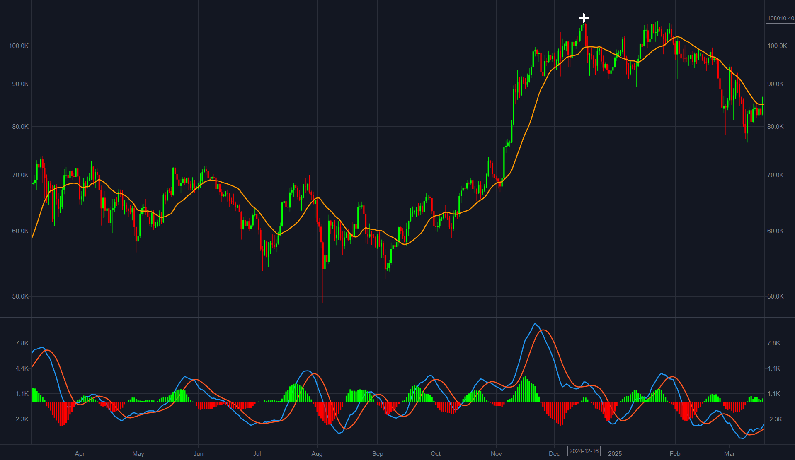
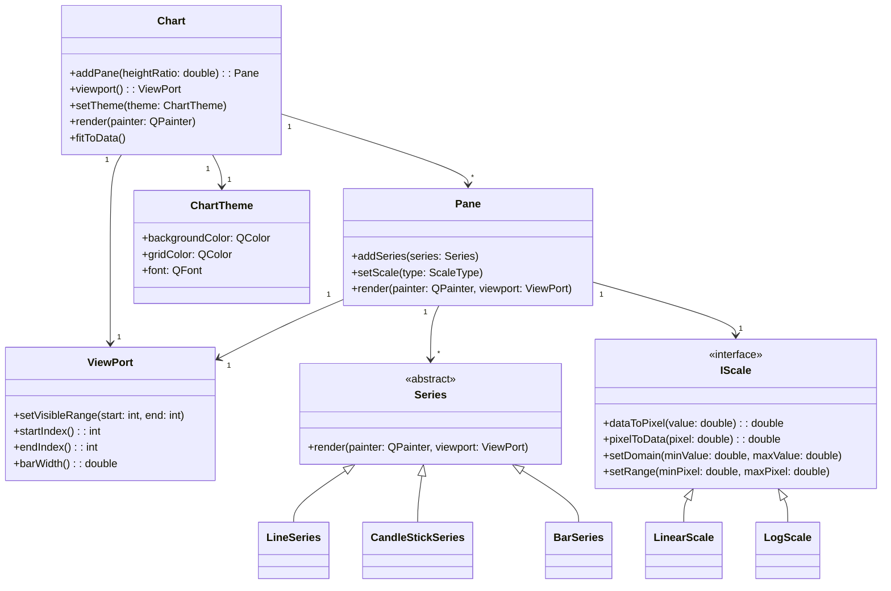

# QTradingView

[]()
[]()
[](https://dhruvan2006.github.io/QTradingView/)
[]()
[]()

A **lightweight, high-performance charting library** built with **C++ and Qt**. Inspired by [TradingView's lightweight-charts](https://github.com/tradingview/lightweight-charts).

Built from scratch to deliver **interactive and scalable visualization** for financial data.

Try it live in your browser: [QTradingView Demo](https://dhruvan2006.github.io/QTradingView/)

<p align="center">
  
  <br/>
  <em>Interactive multi pane candlestick chart</em>
</p>

## Highlights

- 🕹️ **Interactive Features:** Zooming, panning and crosshair tracking
- 📈 **Chart Types:** Line, Candlestick and Bar charts
- 🎨 **Themes:** TradingView inspired light and dark themes
- ⚡ **Performance:** Optimized for large datasets
- 🧩 **Modular Architecture:** Extensible class hierarchy for adding new series and scale types

## Installation

QTradingView can be easily integrated into your CMake-based project using `FetchContent`:

```cmake
cmake_minimum_required(VERSION 3.16)
project(MyProject)

include(FetchContent)

FetchContent_Declare(
        QTradingView
        GIT_REPOSITORY https://github.com/dhruvan2006/QTradingView.git
        GIT_TAG v1.0.0
)

FetchContent_MakeAvailable(QTradingView)

add_executable(MyApp main.cpp)
target_link_libraries(MyApp PRIVATE QTradingView::QTradingView)
```
This automatically downloads, builds, and links QTradingView into your project.

## Usage

Creating charts is simple and modular. Start with a `Chart` add one or more `Panes` and attach series:

```c++
#include <QApplication>
#include <QTradingView>

int main(int argc, char** argv) {
    QApplication app(argc, argv);

    auto chart = new QTradingView::Chart();
    auto pane = chart->addPane(1.0);
    pane->addSeries(std::make_shared<QTradingView::CandleStickSeries>(data));
    chart->show();

    return app.exec();
}
```

More detailed examples can be found in the `examples/` directory.

## Demo

Check out the live demo built with **WebAssembly + Qt**:  
[https://dhruvan2006.github.io/QTradingView/](https://dhruvan2006.github.io/QTradingView/)

Interact with multi-pane candlestick charts directly in your browser.

## Architecture Overview

QTradingView follows a **pane centered architecture**, where the `Chart` acts as the root container that manages the `Viewport` and multiple `Pane` objects.  
Each pane encapsulates its own **series** and **scale**, allowing independent rendering and data transformations.

This modular design enables:
- Efficient rendering of large datasets by updating only affected panes
- Independent control of scales (e.g., linear or logarithmic per pane)
- Easy extension with custom series or scale types


## License

This project is licensed under the **MIT License** - see the [LICENSE](LICENSE) file for details.
