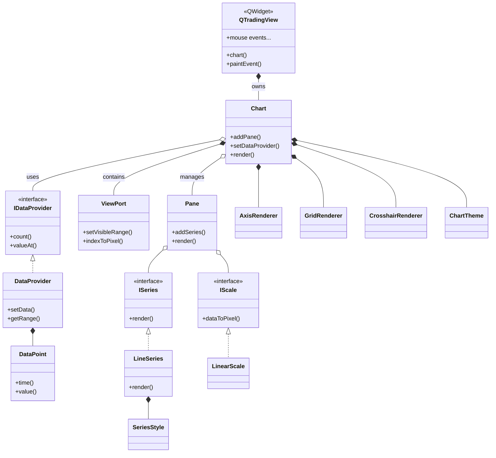

```mermaid
classDiagram
%% ============================
%% Main Widget
%% ============================
class QTradingView {
<<QWidget>>
+chart()
+paintEvent()
+mouse events...
}
QTradingView *-- Chart : owns

    %% ============================
    %% Core Chart
    %% ============================
    class Chart {
        +addPane()
        +setDataProvider()
        +render()
    }
    class Pane {
        +addSeries()
        +render()
    }
    class ViewPort {
        +setVisibleRange()
        +indexToPixel()
    }

    Chart o-- Pane : manages
    Chart *-- ViewPort : contains
    Chart o-- IDataProvider : uses

    %% ============================
    %% Data Model
    %% ============================
    class IDataProvider {
        <<interface>>
        +count()
        +valueAt()
    }
    class DataProvider {
        +setData()
        +getRange()
    }
    class DataPoint {
        +time()
        +value()
    }

    IDataProvider <|.. DataProvider
    DataProvider *-- DataPoint

    %% ============================
    %% Series
    %% ============================
    class ISeries {
        <<interface>>
        +render()
    }
    class LineSeries {
        +render()
    }

    ISeries <|.. LineSeries
    Pane o-- ISeries

    %% ============================
    %% Scale
    %% ============================
    class IScale {
        <<interface>>
        +dataToPixel()
    }
    class LinearScale
    IScale <|.. LinearScale
    Pane o-- IScale

    %% ============================
    %% Renderers
    %% ============================
    class AxisRenderer
    class GridRenderer
    class CrosshairRenderer
    Chart *-- AxisRenderer
    Chart *-- GridRenderer
    Chart *-- CrosshairRenderer

    %% ============================
    %% Styling
    %% ============================
    class ChartTheme
    class SeriesStyle
    Chart *-- ChartTheme
    LineSeries *-- SeriesStyle
```